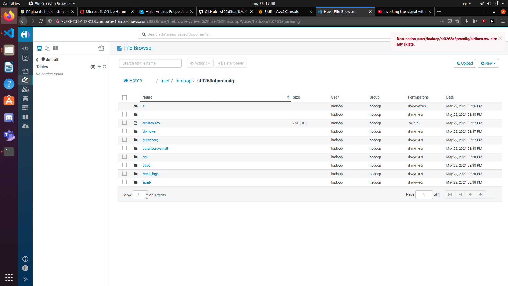
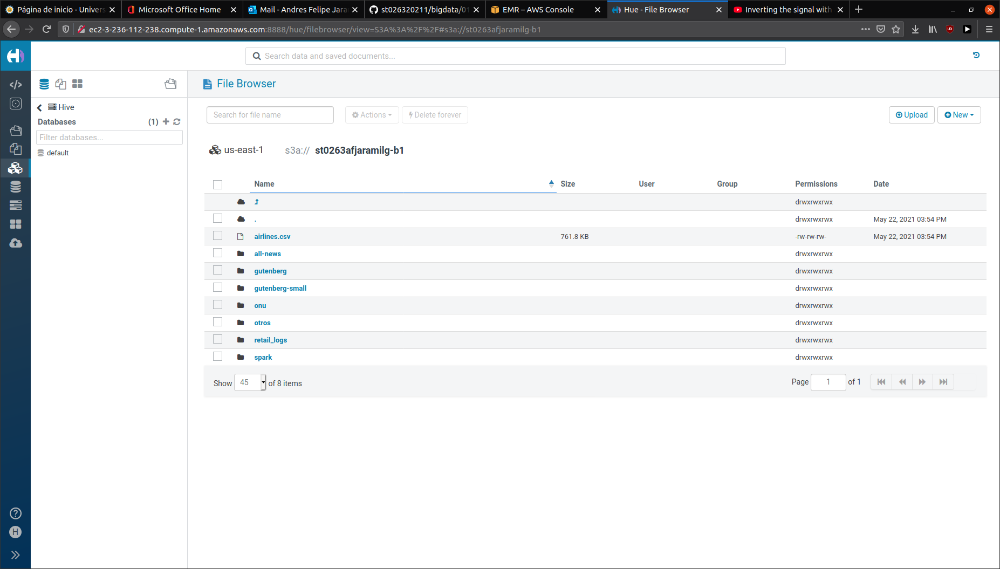
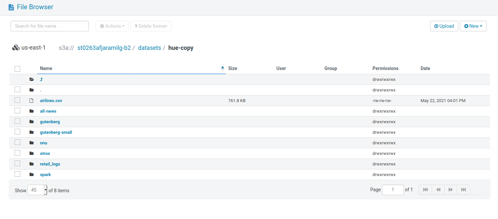

# Lab 1 Big Data
## Andres Felipe Jaramillo 
### Creacion del cluster
El primer paso fue crear el cluster en AWS.


El cluster puede ser recreado con el comando

```
aws emr create-cluster --auto-scaling-role EMR_AutoScaling_DefaultRole --termination-protected --applications Name=Hadoop Name=Hive Name=Hue Name=Spark Name=Zeppelin Name=Tez Name=HBase Name=Livy Name=Sqoop --ebs-root-volume-size 10 --ec2-attributes '{"KeyName":"bigdata_lab","InstanceProfile":"EMR_EC2_DefaultRole","SubnetId":"subnet-4032654e","EmrManagedSlaveSecurityGroup":"sg-05edcde74d01d2e8f","EmrManagedMasterSecurityGroup":"sg-062b4389f4fcddaa5"}' --service-role EMR_DefaultRole --enable-debugging --release-label emr-6.1.0 --log-uri 's3n://aws-logs-664928359875-us-east-1/elasticmapreduce/' --name 'cluster1emr' --instance-groups '[{"InstanceCount":1,"BidPrice":"OnDemandPrice","EbsConfiguration":{"EbsBlockDeviceConfigs":[{"VolumeSpecification":{"SizeInGB":32,"VolumeType":"gp2"},"VolumesPerInstance":2}]},"InstanceGroupType":"MASTER","InstanceType":"m4.xlarge","Name":"Master - 1"},{"InstanceCount":2,"BidPrice":"OnDemandPrice","EbsConfiguration":{"EbsBlockDeviceConfigs":[{"VolumeSpecification":{"SizeInGB":32,"VolumeType":"gp2"},"VolumesPerInstance":2}]},"InstanceGroupType":"CORE","InstanceType":"m4.xlarge","Name":"Core - 2"}]' --scale-down-behavior TERMINATE_AT_TASK_COMPLETION --region us-east-1```
```

### Copia de los datos por Hue
Cree un usuario llamado hadoop en Hue. Cree una carpeta llamada st0263afjaramilg y use la interfaz web para arrastrar todos los archivos del git, habiendo previamente clonado el repositorio.



Despues de haber descargado el key pair correspondiente (bigdata.pem), me conecte con ssh al master del cluster usando el link proveido. Corri los siguientes comandos.
```
# crear directorio ssh-copy
hdfs dfs -mkdir /user/hadoop/st0263afjaramilg/ssh-copy 
sudo yum update
sudo yum install git -y

# clonar repo
git clone https://github.com/st0263eafit/st026320211 

# copiar datos
hdfs dfs -copyFromLocal st026320211/bigdata/datasets/* /user/hadoop/st0263afjaramilg/ssh-copy 
```


### Copia de los datos a un bucket s3
Cree dos buckets llamados st0263afjaramilg-b1 y st0263afjaramilg-b2. Usando la interfaz grafica, copie al primero los datos del dataset.



Despues, desde el master del cluster, corri el siguiente comando para copiar los datos al segundo bucket.
```
hadoop distcp /user/hadoop/st0263afjaramilg/hue-copy s3a://st0263afjaramilg-b2/datasets
```



### Ambari
Despues de logearme en Ambari (https://hdpambari.dis.eafit.edu.co/), cree dos carpetas dentro de /user/afjaramilg: ssh-copy y ambari-copy. En ambari-copy, manualmente cree las carpetas de los data sets y monte todos los archivos. 


Despues fui a la terminal ssh en linea (https://hdpssh.dis.eafit.edu.co) y me logee con mi usuario. Corri los siguientes comandos:
```
# clonar repo
git clone https://github.com/st0263eafit/st026320211 

# copiar datos
hdfs dfs -copyFromLocal st026320211/bigdata/datasets/* /user/afjaramilg/ssh-copy 
```

